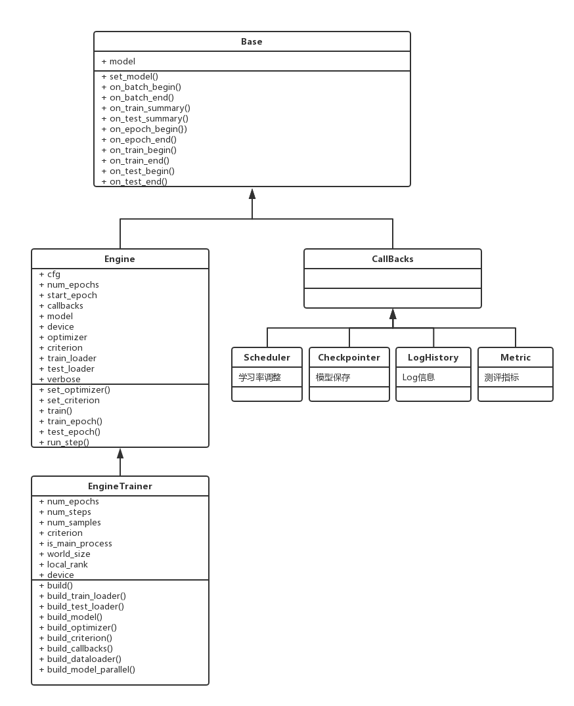

# Pytorch-Base-Trainer



## 1.安装

- 源码安装

```bash
git clone https://github.com/PanJinquan/pytorch-base-trainer
cd pytorch-base-trainer
bash setup.sh #pip install dist/basetrainer-*.*.*.tar.gz
```

- pip安装

```bash
pip install basetrainer
```

## 2.使用方法

`basetrainer`使用方法可以参考[example.py](./example.py)

- step1: 新建一个类`ClassificationTrainer`，继承`trainer.EngineTrainer`
- step2: 实现接口

```python

def build_train_loader(self, cfg, **kwargs):
    """定义训练数据"""
    raise NotImplementedError("build_train_loader not implemented!")


def build_test_loader(self, cfg, **kwargs):
    """定义测试数据"""
    raise NotImplementedError("build_test_loader not implemented!")


def build_model(self, cfg, **kwargs):
    """定于训练模型"""
    raise NotImplementedError("build_model not implemented!")


def build_optimizer(self, cfg, **kwargs):
    """定义优化器"""
    raise NotImplementedError("build_optimizer not implemented!")


def build_criterion(self, cfg, **kwargs):
    """定义损失函数"""
    raise NotImplementedError("build_criterion not implemented!")


def build_callbacks(self, cfg, **kwargs):
    """定义回调函数"""
    raise NotImplementedError("build_callbacks not implemented!")
```

- step3: 在初始化中调用`build`

```python

def __init__(self, cfg):
    super(ClassificationTrainer, self).__init__(cfg)
    ...
    self.build(cfg)
    ...
```

- step4: 实例化`ClassificationTrainer`,并使用`launch`启动分布式训练

```python
def main(cfg):
    t = ClassificationTrainer(cfg)
    return t.run()


if __name__ == "__main__":
    parser = get_parser()
    args = parser.parse_args()
    cfg = setup_config.parser_config(args)
    launch(main,
           num_gpus_per_machine=len(cfg.gpu_id),
           dist_url="tcp://127.0.0.1:28661",
           num_machines=1,
           machine_rank=0,
           distributed=cfg.distributed,
           args=(cfg,))

```

## 3. 回调函数

回调函数需要继承`Callback`, 使用方法可以参考[log_history.py](basetrainer/callbacks/log_history.py)

## 4.其他说明

@pan_jinquan@163.com